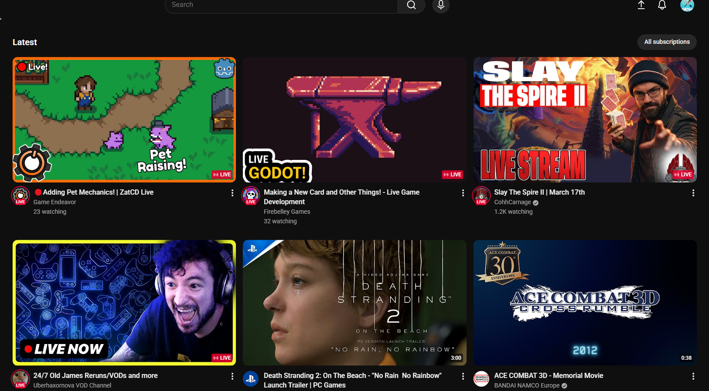

# YouTube Subscriptions Cleaner

A minimal Chrome extension that hides the **Shorts** and **Most Relevant** shelves
on the YouTube subscriptions page — keeping your feed clean and chronological.

## Before


## AFTER



## Why

YouTube's recent update added two new shelves to the subscriptions feed that
interrupt the chronological video list. This extension simply hides them.

## Installation

### From the Chrome Web Store

> Coming soon

### Manual (Developer Mode)

1. Clone this repo

```
   git clone https://github.com/yourusername/youtube-sub-cleaner.git
```

2. Open Chrome and navigate to `chrome://extensions`
3. Enable **Developer Mode** (top right toggle)
4. Click **Load unpacked** and select the cloned folder
5. Navigate to [youtube.com/feed/subscriptions](https://youtube.com/feed/subscriptions)

## How it works

A content script injects a small CSS rule that targets the 2nd and 3rd
`ytd-rich-section-renderer` elements inside `#contents` on the subscriptions
page — which are the Shorts and Most Relevant shelves respectively.
No data is collected, no network requests are made.

## Permissions

| Permission                      | Reason                                        |
| ------------------------------- | --------------------------------------------- |
| `host_permissions: youtube.com` | Required to run the content script on YouTube |

## Contributing

If YouTube updates their DOM and the selectors break, feel free to open a PR
with the updated selectors.

## License

MIT
